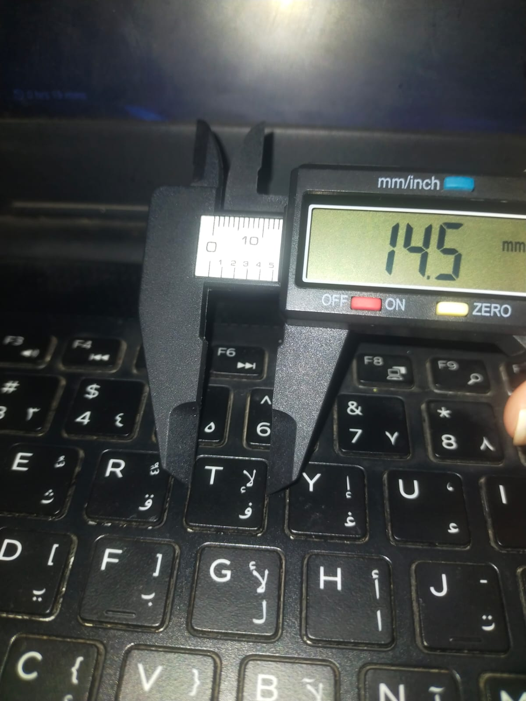
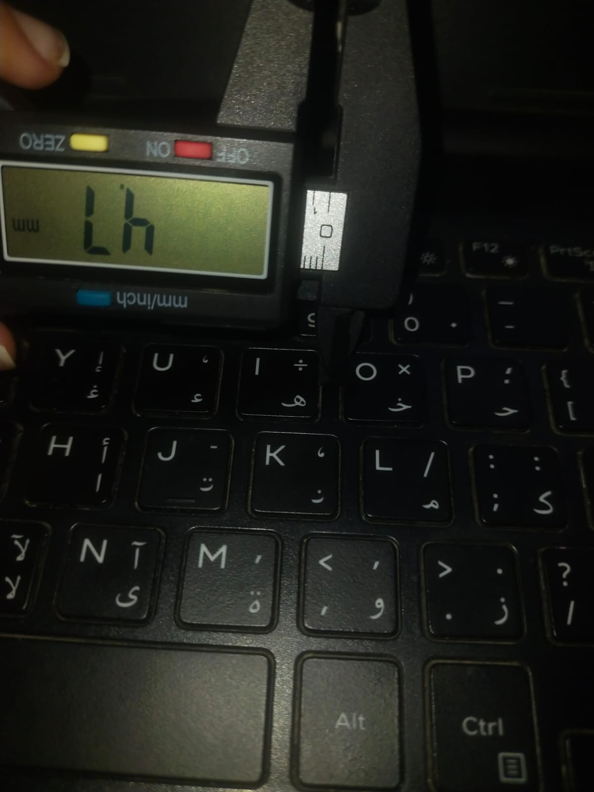
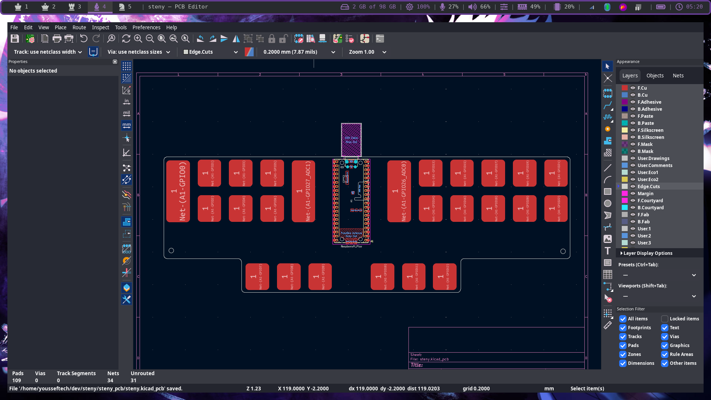
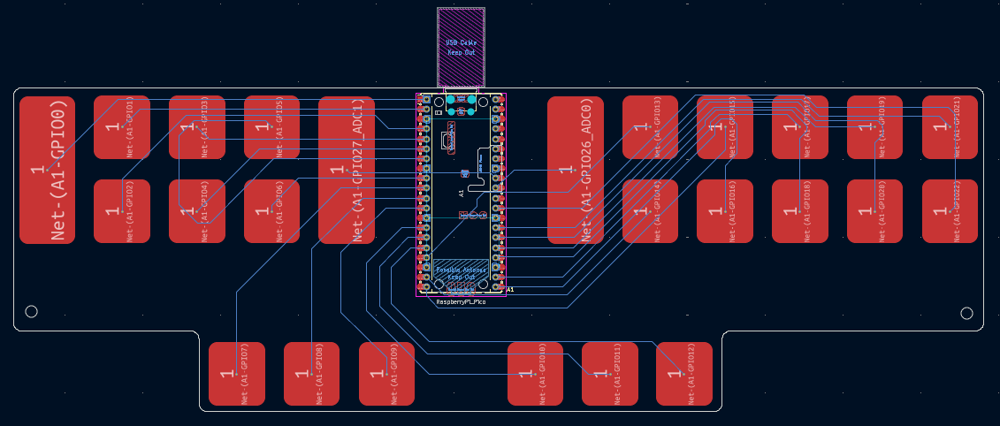
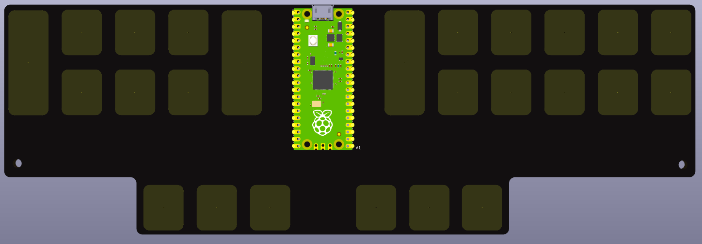
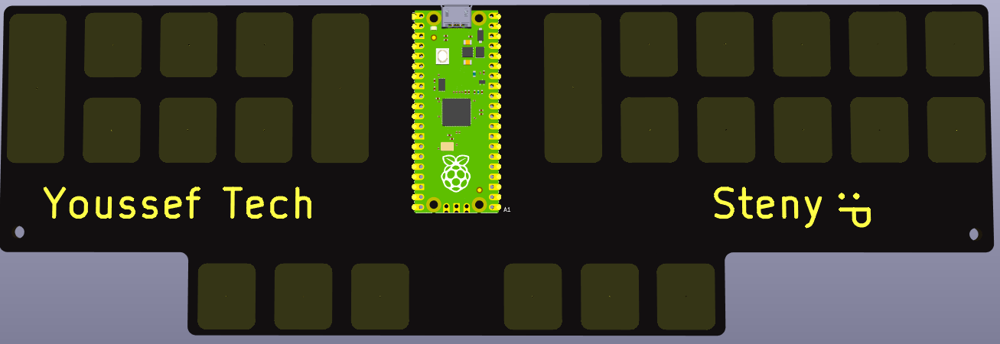
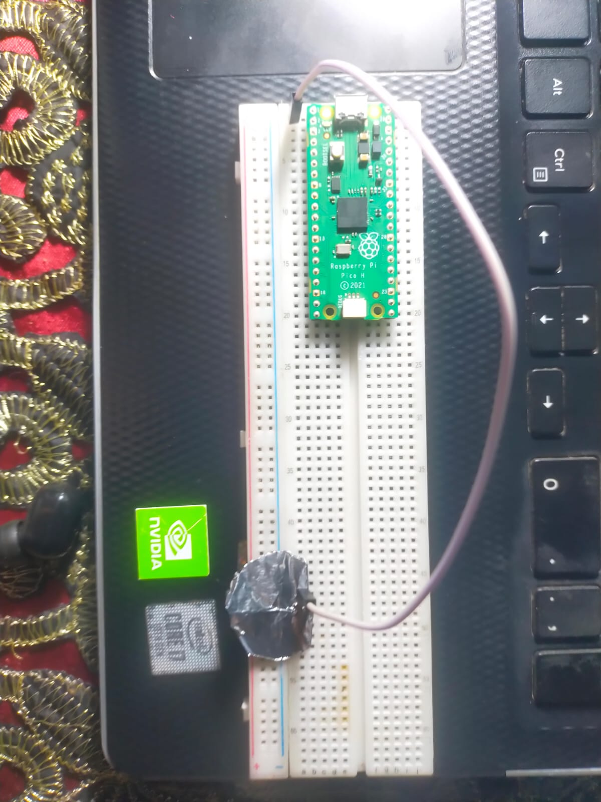
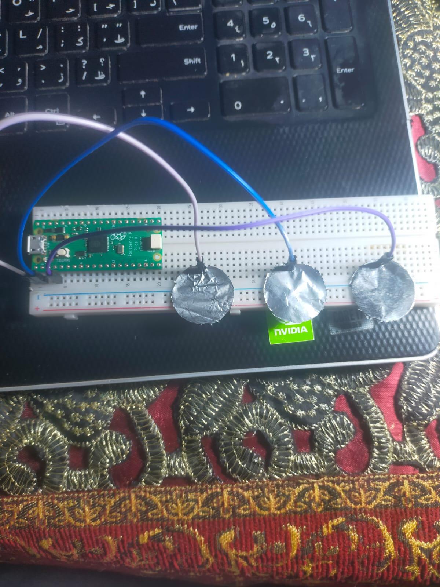

# Journal

Here I'll be documenting my work on this project

## Introduction

Recently, I've been interested in stenography, specifically stenography typing, it's where you use a special keyboard using a special technique where you press down all the *syllables* of the word you want to type at once, you'll notice i said syllables and not letters, that is because a lot of the letters are missing from the keyboard, you type words base on how they're pronounced, not how they're actually spelled, this let's us get rid of C since most of the time it's either pronounced an S or a K. Stenographers can type at speeds of 250+ words per minute, which is what inspired me to learn this skill.

After practicing steno typing for a while on my laptop's QWERTY keyboard, I realized how awful it was to steno type on a non-steno keyboard, so I decided to look up stenography machines for sale, and the prices were a little discouraging to say the least. A conventional stenography machine can be seen in the following image, and it costs from $3000 to $5000.


Seeing how expensive the machine was, and also how outdated it is, as it doesn't just connect to your computer like a normal keyboard, I started researching into alternatives, and I've found a lot of projects made by steno enthusiasts like me, one of which was the [YASK](https://github.com/ttempe/YASK?tab=readme-ov-file) (Yet Another Steno Keyboard), YASK is an open-source, Raspberry Pi Pico based steno keyboard, it was very much what I was looking for, but the only downside is that it used mechanical switches, which I did not have and were not available in my area,so i couldn't just print the YASK PCB and call it a day.


I kept digging again until I found another keyboard, The [Asterisk](https://stenokeyboards.com/products/asterisk-keyboard?srsltid=AfmBOoog4eD7K0TLSjut8bsfzl1NPyijRSejE4kbT-Yz0x29rIsmCrwi) which is touch based, and doesn't rely on any components other than the RP2040 microcontroller (the heart of a Raspberry Pi Pico), The Asterisk is clean, professional, and costs around $50 to buy directly, which is WAY better than buying a stenography machine, but I'm not planning to buy, I'm planning to make my own.


The Asterisk's hardware is closed source, which means I won't be peeking at any PCB designs, BUT it'll serve as great inspiration as I design my own PCB, after all I'll need to tweak the design a bit since I only have a full Raspberry Pi Pico, not just the RP2040 chip, so I couldn't have followed the same design anyways.

## Plan

The plan is to make a touch based steno keyboard using the Raspberry Pi Pico, taking inspiration from the YASK and Asterisk keyboards, I'm not worrying too much about software aspect since I'm planning to use the open-source project, QMK Firmware (Quantum Mechanical Keyboard), which is a firmware designed to aid in making input devices (i.e. keyboards, mice, etc. ).

## Research

I know my way around KiCad, but making copper touch pads directly on the PCB is new for me, so a few chats with ChatGPT later and I got some facts:

- At first I thought the touch pads were loops of copper traces, but they can be plates too.
- There are three ways to sense touch using the Raspberry Pi Pico:

    1. Software sensing: Charge the pad then measure how long it takes to discharge, the time will change with the presence of a finger.
    2. PIO-based touch sensing: Libraries exist for doing so.
    3. External touch controller chips: Trying to avoid these to keep costs down and because I don't have a hot plate to solder surface mounted chips.
- Having the pads too close to each other will cause noise.
- Traces shouldn't exceed 300mm (30cm), which isn't a problem in the case of our keyboard.
- The trace width shouldn't exceed 0.17-0.20mm.

I think I have enough information to start designing.

## Design

### 1. The touch pads/keys

First, I need some measurements, like dimensions for each key/touch-pad.

I felt like the size of my laptop's key's was almost perfect, so I measured one of the key's to use as reference for the pad, ignore how dirty my laptop looks 😓.<br>
<br>
I want it to be a little longer than so I'm probably gonna make the pads 14.5x16.5mm.

<br>
I wanted the spacing to be accurate to my laptop's keyboard but 4.7mm could potentially cause the touch pads to capacitively couple together, so I'm going to settle for 5mm and hope for the best 🙏.

Now for the KiCad footprint, I'll make a big 14.5x16.5mm solder pad, and only enable the F.Cu and F.Mask layers.


And now that the pad footprint is made, we can make the symbol for it.


Here you can see the finished pad design for the PCB and schematic, it shows it connected to one of the GPIO pins on the Raspberry Pi Pico.


And here is a 3D view, I wanted to have the pad exposed to see the stylish copper underneath, but I'm afraid the copper would oxidize over time, so I had to cover it up with solder mask.


After looking at the layout of most steno keyboards, I saw that some keys are longer than others, I didn't wanna take the approach of having two keys on top of each other to compensate for the height of a single key because that would mean signal noise (regretting my decision of making steny touch based), so I decided to make a longer copper pad version.

If you're wondering why the PCB in the 3D view looks so weird, it's because I changed the solder mask color from green to black.

### 2. The schematic

The pad design is finished, now we can get working on the keyboard itself.

This is the standard layout of a steno keyboard:<br>


Let's start on that schematic, first we get all the components we need, I'm going off the YASK layout here, where the number button or # buttons are the red buttons between AO and EU, and the asterisk keys will be two long pads on both sides of the Pi Pico, so we'll need 22 small pads, and 3 long pads.

Before connection:


After connection:

The three pads at the top are the long ones, one for the the double S on the left-most column of the board, and two for the asterisks

### 3. The PCB

This is gonna be the hardest part about this project, if I don't get the spacing, routing, and positions right, this whole thing would flop. I really wanna get this right on the first try cause I'm not reprinting this PCB after testing, PCB printing is pretty expensive in my area 🙏.

Made a few edits to the long pads to compensate for the vertical spacing between the short pads, I made it 38mm instead of 33mm, since the vertical spacing is 5mm, somehow it still wasn't perfectly aligned, but it was good enough, I just wanna print this and test it out as soon as possible 🫤. I then started working on the layout, which has proven to be a very tedious task.

After about 4 hours of layout edits, the occasional footprint edits, and the spacing checks, this is what I ended up with.


Aaaaand for the part I was dreading most, THE TRACE ROUTING 😑.

Here I face an annoying dilemma, I had two approaches I can take with routing and they both have their downsides, here are my options: -

1. Route all traces on the top layer: -
    - Pros:
        - Cheaper because we're ordering a single-layer board.
        - Faster design process.
        - Doesn't require vias.
    - Cons:
        - Traces will couple with nearby pads and cause noise.
        - Lots of clearances must be provided for the traces and the top layer is already too crowded.
2. Route all traces on the bottom layer: -
    - Pros:
        - Less coupling and noise.
        - More space and freedom for longer traces.
        - Traces can be closer together without causing signal noise.
    - Cons:
        - More expensive because the board will be double-layered.
        - Requires through-hole vias which not only make the board more expensive, they're also not supported by most local PCB manufacturers.

Ultimately I had to choose option 2, which means I'll be routing everything on the bottom, this is a very risky move cause I might not find a manufacturer to print the PCB, but I'd rather have a hard time printing it, rather than choosing option one and dealing with the potential noise and unreliability.

After some time of fiddling with traces, looping them around each other and probably making every PCB design mistake in the book, I finally have this.


Pretty sure now we're done with our PCB, here's a look at the 3D viewer before we move onto the firmware.



Actually let's customize our PCB a little, before moving on.

I didn't wanna write some text on the silkcreen and call it a day, I wanted something *shiny*, so I wrote the text on the copper layer and removed the solder mask covering it, here's the final look


### 4. Firmware

I was wondering how I can write firmware for a device that doesn't yet exist, but I had an idea.

I already have a Raspberry Pi Pico, so why not just DIY something for now?

Components I'll be using to test firmware:
- Raspberry Pi Pico
- Breadboard
- Jumper wires
- A coin sized circle of aluminum foil

The foil will act as a touch pad for now. Here's my setup:


I'll write some simple micropython script just to test if this whole touch thing would actually work or if I just wasted 12+ hours of my life (I should've done the test WAAAYY earlier).

Here's the first code tested can be found in [firmware/foiltest.py](firmware/foiltest.py):
```py
from machine import Pin
import time
touch_pin = Pin(0, Pin.IN)
led = Pin(25, Pin.OUT)
def read_touch(pin):
    # Charge the pad
    pin.init(Pin.OUT)
    pin.value(1)
    time.sleep_us(10)
    # Switch to input and time discharge
    pin.init(Pin.IN)
    t = 0
    while pin.value() == 1 and t < 1000:
        t += 1
    return t
while True:
    val = read_touch(touch_pin)
    if val < 35:
        led.value(1)
    else:
        led.value(0)
    time.sleep(0.08)
```

The code charges the foil pad and measures how much time it takes to discharge, I tweaked the threshold to trigger when my finger is placed on the pad and it worked about 90% of the time, it's less reliable than I'd liked, but I've come this far, I can surely make more tweaks to improve it later.

To see if it would work with multiple key's, I made the shown layout:


Here's the code, it's in [firmware/tripadtest.py](firmware/tripadtest.py) too:
```py
from machine import Pin
import time
touch_pin1 = Pin(0, Pin.IN)
touch_pin2 = Pin(1, Pin.IN)
touch_pin3 = Pin(2, Pin.IN)
led = Pin(25, Pin.OUT)
def read_touch(pin):
    # Charge the pad
    pin.init(Pin.OUT)
    pin.value(1)
    time.sleep_us(10)
    # Switch to input and time discharge
    pin.init(Pin.IN)
    t = 0
    while pin.value() == 1 and t < 1000:
        t += 1
    return t
while True:
    val1 = read_touch(touch_pin1)
    val2 = read_touch(touch_pin2)
    val3 = read_touch(touch_pin3)
    if val1 < 35:
        led.value(1)
    elif val2 < 35:
        led.value(1)
    elif val3 < 35:
        led.value(1)
    else:
        led.value(0)
    time.sleep(0.08)
```

Now sensitivity is horrendous, barely registers anything, I've done some tests and it seems like running the `read_touch()` on multiple pins messes with the readings.

I have some possible fixes in mind but it's like 2:20 AM and I'm already tired from the researching and designing the PCB 😓, so good night and see you next commit ✨!