# Journal
Here I'll be documenting my work on this project

## Introduction
Recently, I've been interested in stenography, specifically stengraphy typing, it's where you use a special keyboard using a special technique where you press down all the *syllables* of the word you want to type at once, you'll notice i said syllables and not letters, that is because a lot of the letters are missing from the keyboard, you type words base on how they're pronounced, not how they're actually spelled, this let's us get rid of C since most of the time it's either pronounced an S or a K. Steno typers can type at speeds of 250+ words per minute, which is what inspired me to learn this skill.

After practicing steno typing for a while on my laptop's QWERTY keyboard, I realised how awful it was to steno type on a non-steno keyboard, so I decided to look up stenography machines for sale, and the prices were a little discouraging to say the least. A conventional stenography machine can be seen in the following image, and it costs from $3000 to $5000.

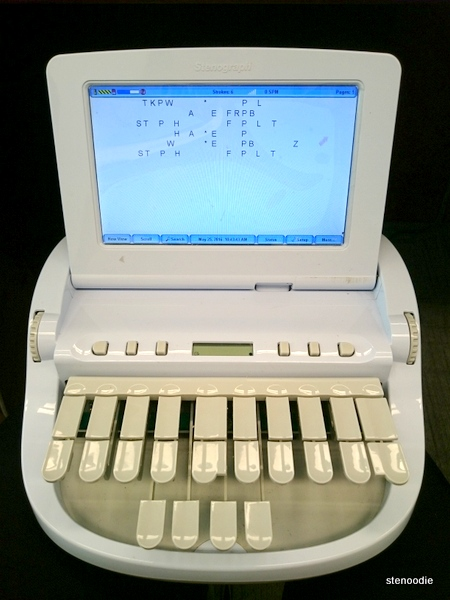

Seeing how expensive the machine was, and also how outdated it is, as it doesn't just connect to your computer like a normal keyboard, I started researching into alternatives, and I've found a lot of projects made by steno enthusiasts like me, one of which was the [YASK](https://github.com/ttempe/YASK?tab=readme-ov-file) (Yet Another Steno Keyboard), YASK is an open-source, Raspberry Pi Pico based steno keyboard, it was very much what I was looking for, but the only downside is that it used mechanical switches, which I did not have and were not available in my area,so i couldn't just print the YASK PCB and call it a day.

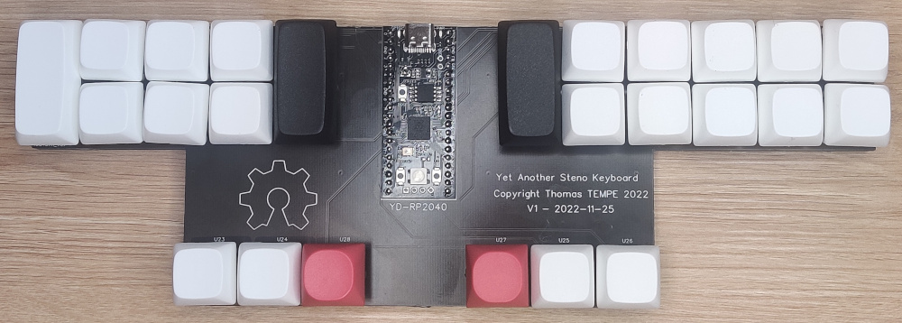

I kept digging again until I found another keyboard, The [Asterisk](https://stenokeyboards.com/products/asterisk-keyboard?srsltid=AfmBOoog4eD7K0TLSjut8bsfzl1NPyijRSejE4kbT-Yz0x29rIsmCrwi) which is touch based, and doesn't rely on any components other than the RP2040 microcontroller (the heart of a Raspberry Pi Pico), The Asterisk is clean, professional, and costs around $50 to buy directly, which is WAY better than buying a stenography machine, but I'm not planning to buy, I'm planning to make my own.

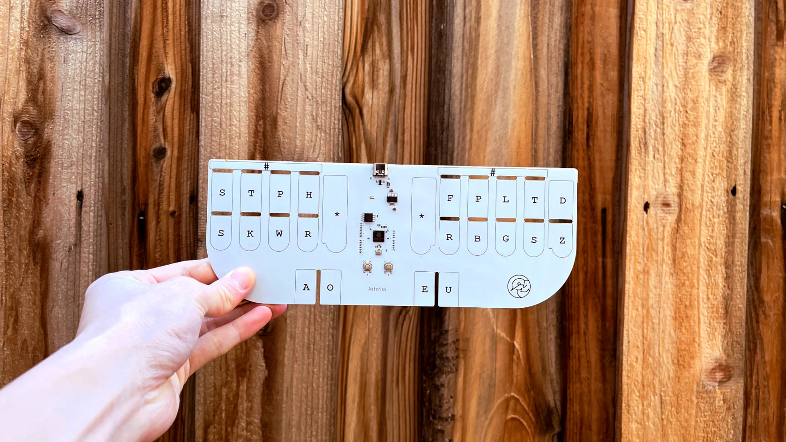

The Asterisk's hardware is closed source, which means I won't be peeking at any PCB designs, BUT it'll serve as great inspiration as I design my own PCB, afterall I'll need to tweak the design a bit since I only have a full Raspberry Pi Pico, not just the RP2040 chip, so I couldn't have followed the same design anyways.

## Plan
The plan is to make a touch based steno keyboard using the Raspberry Pi Pico, taking inspiration from the YASK and Asterisk keyboards, I'm not worrying too much about software aspect since I'm planning to use the open-source project, QMK Firmware (Quantum Mechanical Keyboard), which is a firmware designed to aid in making input devices (i.e. keyboards, mice, etc. ).

## Research
I know my way around kicad, but making copper touch pads directly on the PCB is new for me, so a few chats with ChatGPT later and I got some facts:
- At first I thought the touch pads were loops of copper traces, but they can be plates too.
- There are three ways to sense touch using the Raspberry Pi Pico:
    
    1. Software sensing: Charge the pad then measure how long it takes to dischare, the time will change with the presence of a finger.
    2. PIO-based touch sensing: Libraries exist for doing so.
    3. External touch controller chips: Trying to avoid these to keep costs down and because I don't have a hot plate to solder surface mounted chips.
- Having the pads too close to eachother will cause noise.
- Traces shouldn't exceed 300 mm, which isn't a problem in the case of our keyboard.
- The trace width shouldn't exceed 0.17-0.20 mm.

I think I have enough information to start designing.

## Design

### 1. The touch pads/keys
First, I need some measurements, like dimensions for each key/touch-pad.

I felt like the size of my laptop's key's was almost perfect, so I measured one of the key's to use as referece for the pad, ignore how dirty my laptop looks 😓.

I want it to be a little longer than so I'm probably gonna make the pads 14.5x16.5mm.

I wanted the spacing to be accurate to my laptop's keyboard but 4.7mm could protentially cause the touch pads to capacitively couple together, so I'm going to settle for 5mm and hope for the best 🙏.

Now for the KiCad footprint, I'll make a big 14.5x16.5 mm solder pad, and only anable the F.Cu and F.Mask layers.
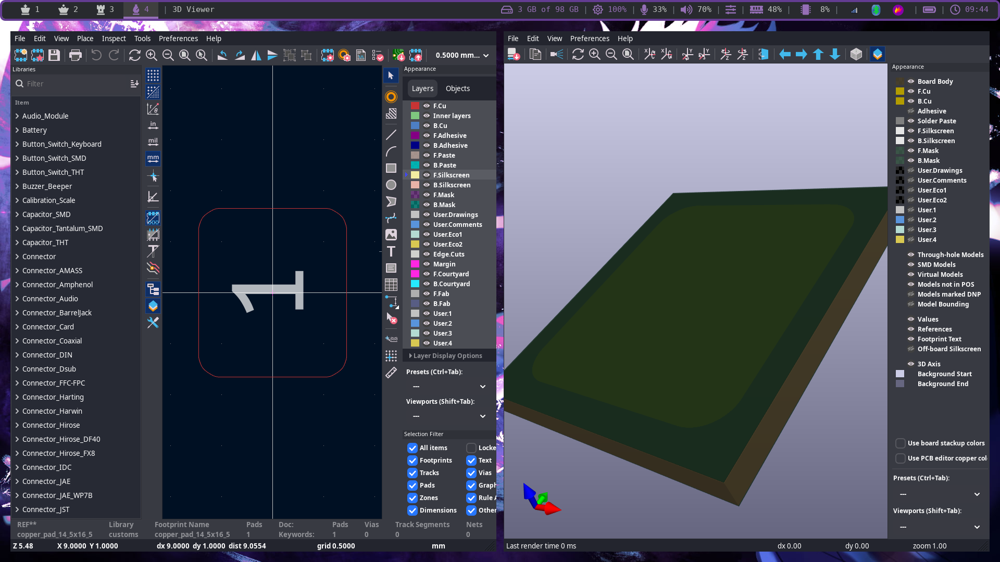

And now that the pad footprint is made, we can make the symbol for it.
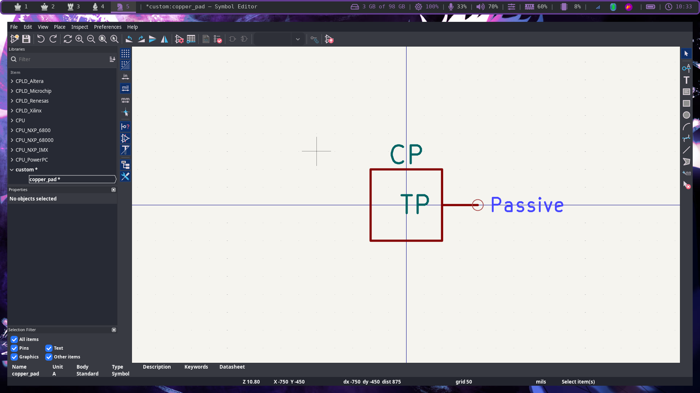

Here you can see the finished pad disign for the PCB and schematic, it shows it connected to one of the GPIO pins on the Raspberry Pi Pico.
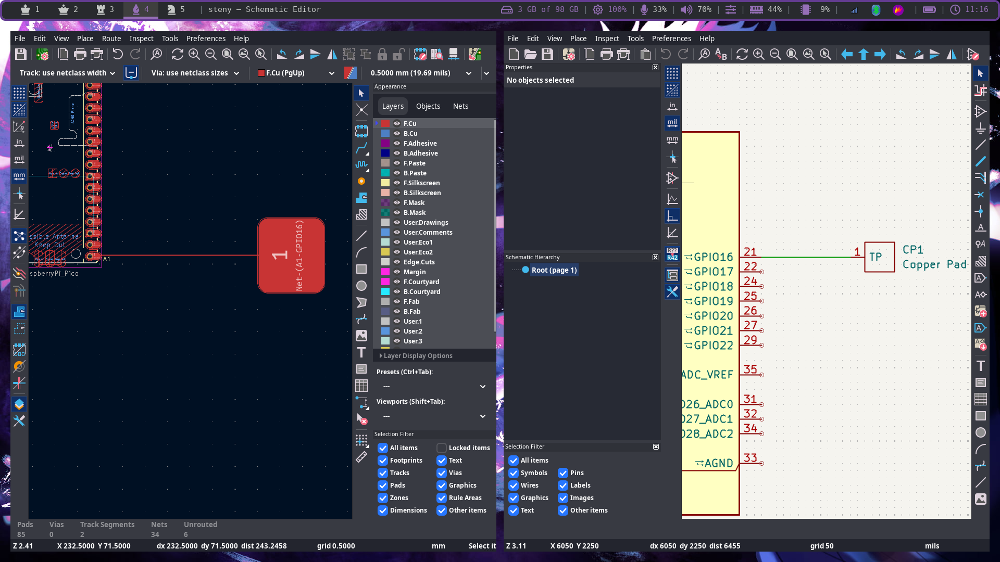

And here is a 3D view, I wanted to have the pad exposed to see the stylish copper underneath, but I'm afraid the copper would oxidise over time, so I had to cover it up with solder mask.
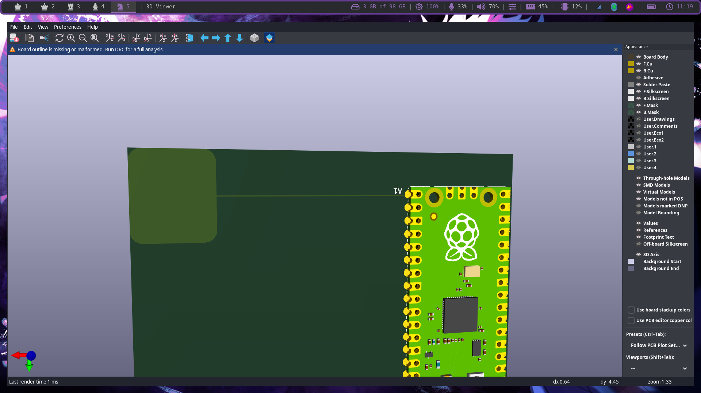

After looking at the layout of most steno keyboards, I saw that some keys are longer than others, I didn't wanna take the approach of having two keys on top of eachother to compensate for the height of a sigle key because that would mean signal noise (regretting my decision of making steny touch based), so I decided to make a longer copper pad version.
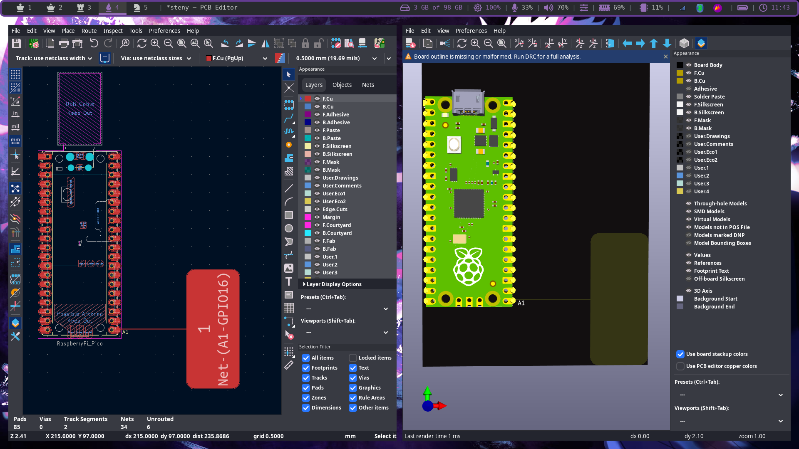
If you're wondering why the PCB in the 3D view looks so weird, it's because I changed the solder mask color from green to black.

### 2. The schematic
The pad design is finished, now we can get working on the keyboard itself.

This is the standard layout of a steno keyboard:
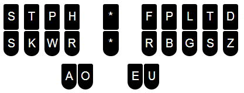

Let's start on that schematic, first we get all the components we need, I'm going off the YASK layout here, where the number button or # buttons are the red buttons between AO and EU, and the asterisk keys will be two long pads on both sides of the Pi Pico, so we'll need 22 small pads, and 3 long pads.

Before connection:
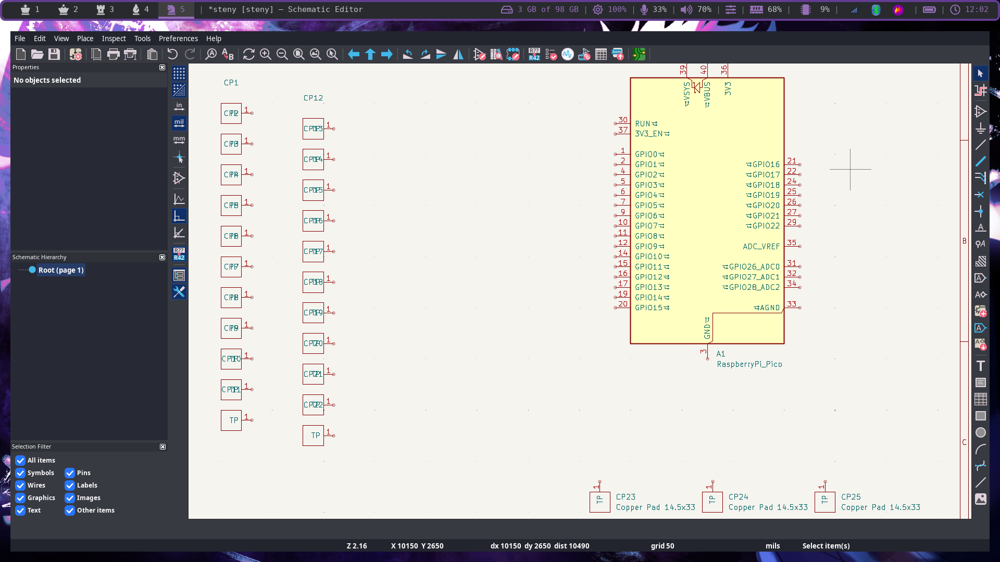

After connection:
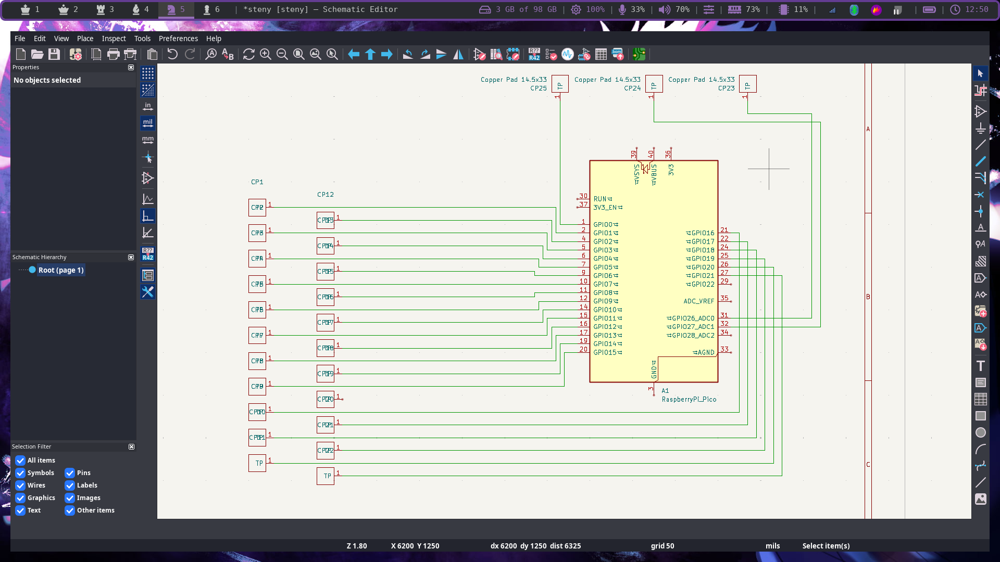
The three pads at the top are the long ones, one for the the double S on the left-most column of the board, and two for the asterisks

### 3. The PCB
This is gonna be the hardest part about this project, if I don't get the spacing, routing, and postitions right, this whole thing would flop. I really wanna get this right on the first try cause I'm not reprinting this PCB after testing, PCB printing is pretty expensive in my area 🙏.